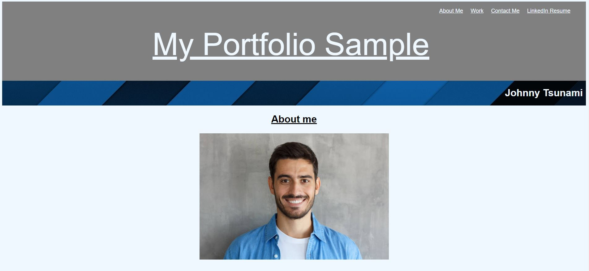

# Module2Challenge
## Description

Bootcamp: Module 2 Challenge  
Sample portfolio creation  
Codebase correction that follows accessibility standards so that the site is optimized for search engines

## Table of Contents (Optional)

N/A

## Installation

Github pages hosting: https://fjnelson.github.io/Module2Challenge/

## Usage

## Credits

Layout ideas taken from the module 2 challenge of the course  
Source: https://courses.bootcampspot.com/courses/2756/assignments/42553?module_item_id=798951
 
About me copied from ficticious character The Fresh Prince of Bel Air  
Source: https://genius.com/Dj-jazzy-jeff-and-the-fresh-prince-the-fresh-prince-of-bel-air-lyrics
 
Youtube video of Will Smith: https://www.youtube.com/watch?v=0jccwzrXnho&ab_channel=DarkReality  
Credit: DarkReality
 
All photos taken from Google Search / Images

## License

Please refer to the LICENSE in the repo.